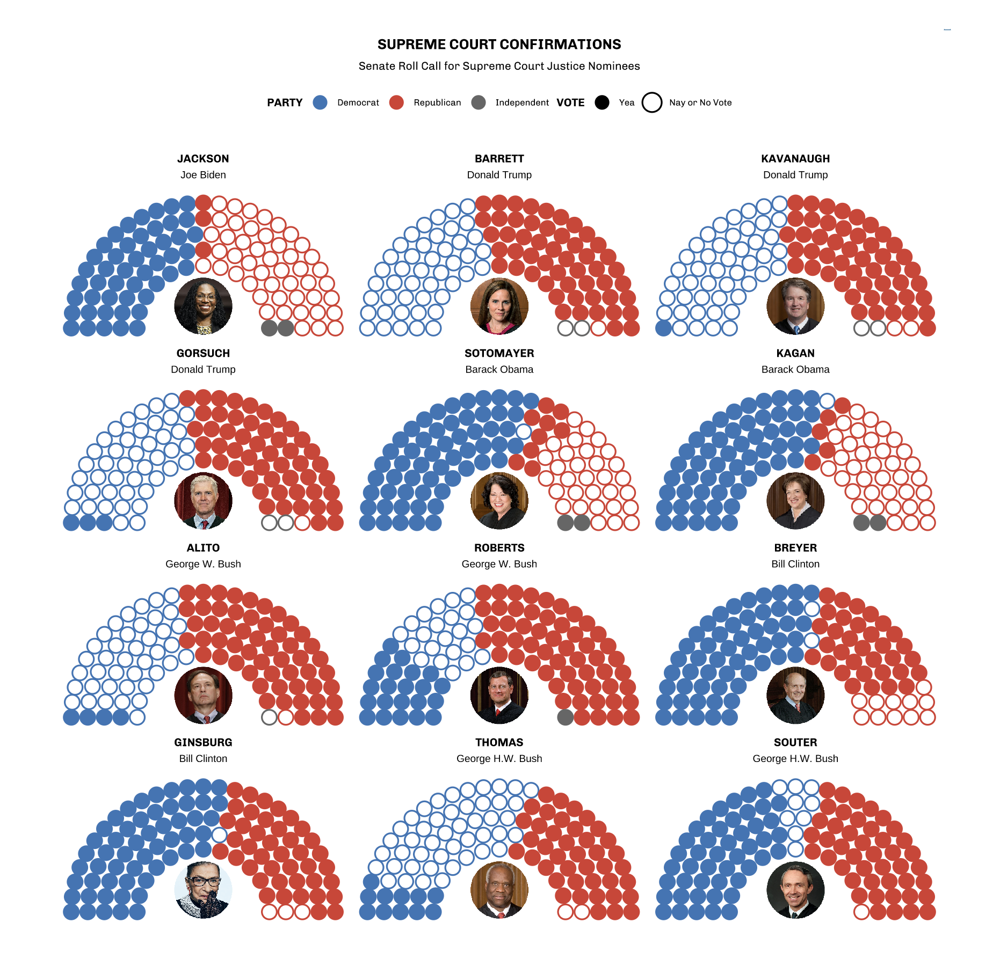
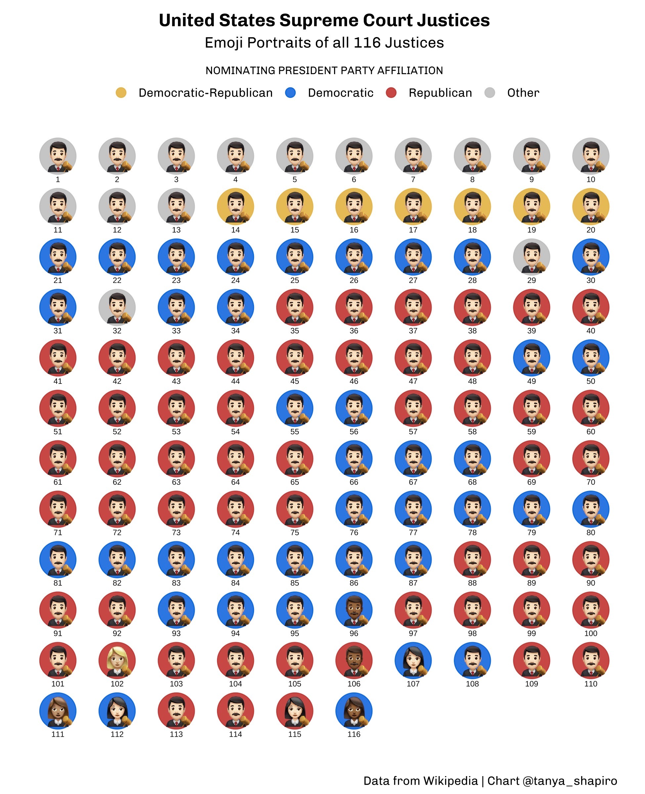

# Supreme Court Justices

## Summary

While watching Justice Ketanji Brown Jackson's Supreme Court confirmation hearings, I became curious about previous Supreme Court nominations and the U.S. Senate's voting track record. Were previous nominations just as contentious? Was voting always split down party lines? Moreover, I wanted to visualize the demographic make-up of all sitting justices.

## Data
To dive into these questions, I rolled up my sleeves and prepared myself for some data wrangling. Since the data was not readily available in tabular format, I sought out information on a combination of government websites, e.g. [senate.gov](https://www.senate.gov/), and Wikipedia pages. I created scripts to scrape the data from each page. Web scraping was conducted in R with **rvest** and **httr** packages.

## Visualizations

### Senate Roll Call
The following visualization looks at Senate Roll call data for the past 12 successful Supreme Court Justice nominations. Points are colored based on each Senator's political party. Filled points indicate a "Yea" vote, wherease outlined points indicate a "Nay" or "Not Voting" vote. The visual was rendered using **ggplot** and ggplot extension packages, **ggparliament** and **ggimage**. An interactive version of this visual was created using ggigraph and is hosted on my [website](https://www.tanyashapiro.com/interactive-visuals/supreme-court).  &nbsp;

### Supreme Court Emoji Portraits
This pitogram aims to visualize the make-up of all sitting Supreme Court Justices throughout history (+ Ketanji Brown Justice, who at the time had not yet been sworn in). Emojis were used to denote gender and race. Colored background points represent the political party of the nominationg president (e.g. Blue for Democrat). Interactive version created using **ggiraph** and available [here](https://www.tanyashapiro.com/interactive-visuals/supreme-court-history).

